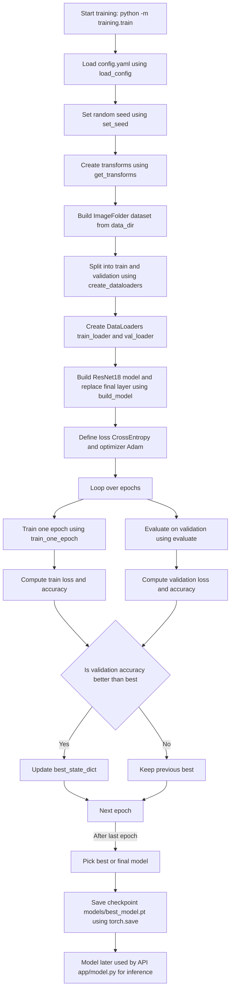

## Training pipeline overview

This folder contains everything related to **training the image classification model** that powers your app.

At a high level:

- Images are loaded from `data_dir` (configured in `config.yaml`) where each **subfolder name is a class label** (e.g. `academic/`, `lifestyle/`, `bar/`).
- The script applies **data augmentation and preprocessing**.
- A **ResNet18** model (pretrained on ImageNet) is fine‑tuned on your dataset.
- The best (or final) model weights plus the class names are saved into `models/best_model.pt`.

You start training by running from the project root:

```bash
python -m training.train
```

---

## `config.yaml`

This file controls **where data comes from and how training behaves**.

- **`data_dir`**: path to the root folder of your training images (each subfolder = category).
- **`output_model_path`**: where to save the trained model checkpoint, usually `models/best_model.pt`.
- **`categories`**: list of expected class names (for your understanding and documentation; the actual labels come from folder names).
- **`training` block**:
  - **`batch_size`**: how many images per gradient step.
  - **`num_epochs`**: how many full passes over the training data.
  - **`learning_rate`**: step size for Adam optimizer.
  - **`weight_decay`**: L2 regularization to reduce overfitting.
  - **`val_split`**: fraction of data set aside for validation (e.g. 0.2 = 20%).
  - **`num_workers`**: number of DataLoader workers (0 on macOS avoids shared‑memory issues).
  - **`image_size`**: images are resized to this square size (e.g. 224×224).
- **`random_seed`**: ensures reproducible splits and training initialization.

---

## `train.py` – function by function

### `load_config(config_path: str) -> dict`

Reads `training/config.yaml` and returns a Python dict.  
Used by `main()` to get all training parameters in one place.

### `set_seed(seed: int) -> None`

Sets seeds for Python’s `random` and PyTorch (CPU and CUDA) so that:

- The train/validation split, weight initialization, and minibatch order are **reproducible** across runs.

### `get_transforms(image_size: int)`

Defines how raw images are turned into tensors for the model.

- **Training transform**:
  - Resize to `(image_size, image_size)`.
  - Random horizontal flip.
  - Random small rotation.
  - Color jitter (brightness/contrast/saturation).
  - Convert to tensor.
  - Normalize with ImageNet mean/std.
- **Validation transform**:
  - Same resize + normalize, **without random augments** (deterministic).

Returns `(train_transform, val_transform)` and is used inside `create_dataloaders`.

### `create_dataloaders(cfg: dict)`

Responsible for:

- Reading `data_dir` from config.
- Creating a single `ImageFolder` dataset where:
  - Each subdirectory name under `data_dir` is a **class label**.
  - All images in that folder belong to that class.
- Splitting it into **train** and **validation** subsets using `val_split`.
- Assigning:
  - Training subset → training transform (with augmentation).
  - Validation subset → validation transform.
- Wrapping both subsets into `DataLoader`s that:
  - Batch images,
  - Shuffle training data each epoch,
  - Use `num_workers` worker processes/threads for loading.

Returns:

- `train_loader`: yields (image_tensor, label_index) batches for training.
- `val_loader`: yields (image_tensor, label_index) batches for validation.
- `class_names`: list mapping label indices → human‑readable class names.

### `build_model(num_classes: int) -> nn.Module`

Creates the **ResNet18** classifier:

- Loads a pretrained `resnet18` from `torchvision.models`.
- Replaces the final fully connected layer `model.fc` with a new `nn.Linear` that has:
  - `in_features` set to the ResNet feature size.
  - `out_features` equal to `num_classes` (your categories).

This is the core model you fine‑tune.

### `train_one_epoch(model, criterion, optimizer, dataloader, device)`

Runs **one full pass** over the training data:

- Puts model in **training mode** (`model.train()`).
- For each batch:
  - Moves inputs and labels to `device` (CPU or GPU).
  - Zeros gradients (`optimizer.zero_grad()`).
  - Computes predictions (`outputs = model(inputs)`).
  - Computes classification loss (`criterion(outputs, labels)` → cross‑entropy).
  - Backpropagates (`loss.backward()`).
  - Updates parameters (`optimizer.step()`).
  - Accumulates total loss and correct predictions.
- Returns:
  - `epoch_loss`: average loss across all training samples.
  - `epoch_acc`: training accuracy over the epoch.

### `evaluate(model, criterion, dataloader, device)`

Same as `train_one_epoch`, but for **validation**:

- Puts model in **evaluation mode** (`model.eval()`).
- Disables gradient computation (`torch.no_grad()`).
- Computes loss and accuracy on the validation set without updating weights.

Returns `(val_loss, val_acc)`.

### `main()`

This is the entrypoint when you run `python -m training.train`:

1. **Load config** → `cfg = load_config()`.
2. **Set random seed** → `set_seed(cfg.get("random_seed", 42))`.
3. **Ensure output directory exists** for the model file.
4. **Select device** → GPU if available, else CPU.
5. **Create dataloaders** → `train_loader`, `val_loader`, `class_names`.
6. **Build model** with correct output size for your classes and move it to `device`.
7. **Define loss & optimizer**:
   - `criterion = nn.CrossEntropyLoss()`.
   - `optimizer = Adam(model.parameters(), lr, weight_decay)`.
8. **Training loop** over `num_epochs`:
   - Call `train_one_epoch` and `evaluate`.
   - Print train/val loss and accuracy.
   - Track the **best validation accuracy** and store the corresponding `state_dict`.
9. **Saving the model**:
   - If a best validation model was tracked → save that.
   - If not (e.g. tiny dataset / no val samples) → save the **final model**.
   - Use `torch.save` to write:
     - `"model_state_dict"`: the learned parameters.
     - `"class_names"`: list of class labels.
   - Output file path is `output_model_path` from `config.yaml` (typically `models/best_model.pt`).

The saved file is what the **API (`app/model.py`) loads** to serve predictions in your web app.

---

## Visual summary – training flow (Mermaid diagram)





